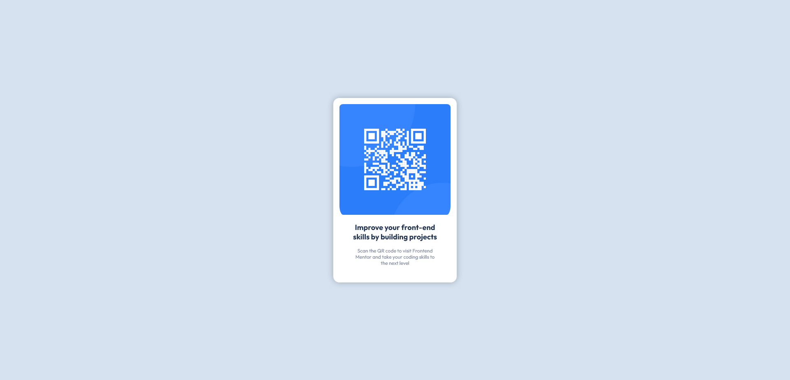

# Frontend Mentor - QR code component solution

This is a solution to the [QR code component challenge on Frontend Mentor](https://www.frontendmentor.io/challenges/qr-code-component-iux_sIO_H). Frontend Mentor challenges help you improve your coding skills by building realistic projects. 

## Table of contents

- [Overview](#overview)
  - [Screenshot](#screenshot)
  - [Links](#links)
- [Author](#author)

## Overview

### Screenshot

### Links

- Solution URL: [https://github.com/aravindhan7/qrcode-challenge](https://your-solution-url.com)
- Live Site URL: [https://aravindhan7.github.io/qrcode-challenge/](https://your-live-site-url.com)

## Author

- Website - [https://aravindhan-portfolio-website.netlify.app/](https://www.your-site.com)
- Frontend Mentor - [https://www.frontendmentor.io/profile/aravindhan7](https://www.frontendmentor.io/profile/yourusername)

